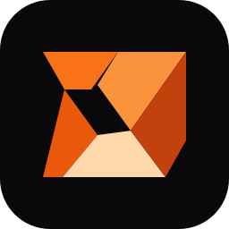

<p align="center">
  
</p>

<h1 align="center">Flowie</h1>

<p align="center"><strong>Open-source project management &amp; team collaboration platform</strong></p>

<p align="center">
  <a href="./README.vi.md">🇻🇳 Tiếng Việt</a> · <strong>🇬🇧 English</strong>
</p>

<p align="center">
  
  
  
  
  
  
  <a href="./LICENSE.md"></a>
</p>

---

## 📌 Overview

Flowie is a self-hosted workspace for planning, tracking and delivering work with teams. It preserves the refined Circle interface while progressively replacing fixture data with a native Python/FastAPI and PostgreSQL backend.

It supports more than software delivery: product, operations, research, marketing and other project-based work can be organised in the same workspace.

## ✨ Key features

- **Workspaces & access** — registration, refresh sessions, invitations, roles, workspace switching and profile avatars stored in MinIO.
- **Teams & members** — create teams, customise names/icons/settings, manage membership and team documents.
- **Issues** — real workflows, statuses, priorities, assignees, labels, due dates, comments, relations, templates and reminders.
- **Cycles** — create Active or Upcoming cycles, assign issues and inspect persisted progress/burn-up data.
- **Projects & initiatives** — projects, milestones, custom fields, templates, labels, updates and initiative links.
- **Collaboration** — documents, resources, activity history, attachments and Discord notification configuration.
- **Administration** — platform administrator bootstrap, workspace management and audit endpoints.

The implementation inventory and remaining adapter work are tracked in [implement_plan.md](./implement_plan.md). A control is not marked complete merely because it has a mock screen.

## 🧱 Architecture

| Layer | Technology | Responsibility |
| --- | --- | --- |
| Web | Next.js 15, React 19, TypeScript, Tailwind | Circle UI presentation and live-data adapters |
| API | Python 3.12, FastAPI, SQLAlchemy | Authentication, RBAC, domain APIs and business logic |
| Data | PostgreSQL 16 | Durable workspace, team, issue, project and activity data |
| Services | Redis, MinIO | Background coordination and object storage |
| Runtime | Docker Compose | Reproducible local and internal-network deployment |

> A legacy compatibility service remains only while routes are migrated. New backend work belongs in `apps/api-python`; the plan records the exact migration status.

## 🚀 Quick start

### Run with existing Docker images — internal network safe

This does not build, pull images or install packages:

```powershell
.\scripts\start-local.ps1
```

Open [http://localhost:3000](http://localhost:3000). FastAPI readiness is available at [http://localhost:4000/readyz](http://localhost:4000/readyz).

### Build and smoke-test — use a network that permits downloads

The first build, a dependency change or a base-image update can contact registries. Explicitly opt in while on 5G or another permitted network:

```powershell
.\scripts\build-and-test.ps1 -AllowNetwork
```

The script builds Docker images, starts the stack and checks the web login page and FastAPI readiness endpoint. Afterwards, return to the internal network and use `start-local.ps1` for ordinary runs.

### Default local URLs

| Service | URL |
| --- | --- |
| Flowie web | [http://localhost:3000](http://localhost:3000) |
| FastAPI OpenAPI docs | [http://localhost:4000/docs](http://localhost:4000/docs) |
| FastAPI readiness | [http://localhost:4000/readyz](http://localhost:4000/readyz) |
| MinIO console | [http://localhost:9001](http://localhost:9001) |

## ⚙️ Local development

1. Copy `.env.example` to `.env` and keep values private.
2. Set `ADMIN_BOOTSTRAP_EMAIL`, `ADMIN_BOOTSTRAP_PASSWORD` and `ADMIN_BOOTSTRAP_NAME` before the first start when an administrator account is required.
3. On a network that allows downloads, run `pnpm install` once.
4. Start infrastructure with `pnpm infra:up`, then run `pnpm dev`.

```bash
pnpm build             # full TypeScript/Next build
pnpm docker:build      # build images (may need network)
pnpm docker:up         # start existing images without build/pull
pnpm docker:down       # stop the application profile
```

Never commit `.env`, credentials, tokens or webhook URLs.

## 🗺️ Development rules

1. Preserve the original Circle UI structure, spacing and interaction model.
2. Replace mock reads/writes with Python/PostgreSQL, or add an explicitly approved feature.
3. Verify persistence after refresh and workspace/RBAC isolation.
4. Update [implement_plan.md](./implement_plan.md), commit and push every completed vertical slice.

## 🙏 Attribution & license

Flowie evolves the UI foundation from [ln-dev7/circle](https://github.com/ln-dev7/circle) into a self-hosted, server-backed product. See [LICENSE.md](./LICENSE.md) for the MIT license and attribution terms.
