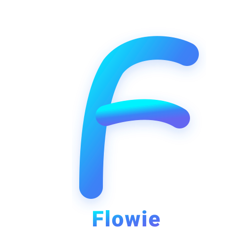

<div align="center">
  
  <h1>Flowie</h1>
  <p><b>Enterprise-Grade Project Management & Team Collaboration Platform</b></p>

  <p>
    <a href="https://golang.org"></a>
    <a href="https://nextjs.org"></a>
    <a href="https://www.typescriptlang.org"></a>
    <a href="https://www.postgresql.org"></a>
    <a href="https://www.docker.com"></a>
    <a href="LICENSE"></a>
  </p>

  <br />
</div>

---

## 📌 Giới thiệu (Overview)

**Flowie** là giải pháp quản lý dự án cấp doanh nghiệp (Enterprise Project Management Platform) toàn diện, hiện đại và tối ưu hiệu suất. Nền tảng được thiết kế giúp các tổ chức và đội ngũ công nghệ dễ dàng lập kế hoạch, theo dõi tiến độ, tự động hóa quy trình làm việc và tích hợp sâu với hệ sinh thái Microsoft (Azure AD SSO & SharePoint).

---

## ✨ Tính năng nổi bật (Key Features)

- 🗂️ **Đa chế độ xem công việc (Multi-View Management):**
  - **Kanban Board:** Kéo thả linh hoạt, quản lý WIP limit chặn nghẽn cổ chai.
  - **Timeline (Gantt Chart):** Theo dõi đường găng (Critical Path Method) và tiến độ tổng thể.
  - **Agile Sprints:** Lập kế hoạch Sprint 1–2 tuần, quản lý backlog và vận tốc đội ngũ (Velocity).
  - **Calendar & Workload:** Lịch công việc trực quan và phân bổ tải trọng thành viên.

- ⚡ **Tự động hóa quy trình (Automation Engine):**
  - Cấu hình quy tắc **Trigger → Action** tự động gán việc, đổi trạng thái và bắn thông báo khi công việc cập nhật.

- 🔐 **Bảo mật doanh nghiệp & SSO (Enterprise Security):**
  - Đăng nhập một chạm **Azure AD / Microsoft Entra ID (OIDC & OAuth2)**.
  - Quản lý phiên đăng nhập (Remote Session Revocation), xác thực 2 yếu tố (2FA) và phân quyền RBAC khắt khe.

- 📁 **Tích hợp lưu trữ SharePoint (Document Sync):**
  - Tự động sinh cây thư mục lưu trữ file dự án trên **SharePoint** thông qua Microsoft Graph API.

- 📈 **Báo cáo & Phân tích chuyên sâu (Agile Analytics):**
  - Biểu đồ Burndown, báo cáo năng suất công việc và tự động gửi digest báo cáo định kỳ qua Slack / MS Teams.

- 💬 **Thảo luận & Tương tác thời gian thực (Workspace Chat):**
  - Trò chuyện theo kênh dự án, bình luận công việc và hệ thống thông báo tức thì.

---

## 🛠️ Công nghệ sử dụng (Tech Stack)

| Tầng (Layer) | Công nghệ (Technology) | Ghi chú (Description) |
| :--- | :--- | :--- |
| **Backend** | **Go 1.26** (Standard library + `chi` router) | RESTful API server hiệu năng cao |
| **Database** | **PostgreSQL 16** + `sqlc` & `pgx` | Quản lý dữ liệu quan hệ, type-safe queries |
| **Frontend** | **Next.js 16** (React 19, TypeScript, TailwindCSS) | Giao diện Single Page Application mượt mà |
| **Authentication** | **Azure AD** (OpenID Connect / OAuth2) | Đăng nhập doanh nghiệp & JWT Session Manager |
| **File Storage** | **SharePoint / Microsoft Graph API** | Lưu trữ và đồng bộ tài liệu tự động |
| **DevOps & Containers** | **Docker Compose** | Môi trường phát triển và đóng gói sẵn sàng |

---

## 📁 Cấu trúc dự án (Directory Structure)

```text
Flowie/
├── logo.svg                   # Logo biểu tượng dự án (SVG Vector)
├── docker-compose.yml         # Cấu hình container PostgreSQL & Services
├── .env.example               # Biến môi trường mẫu
│
├── backend/                   # Go Backend API Server
│   ├── cmd/api/               # Entrypoint HTTP server chính
│   ├── internal/
│   │   ├── auth/              # Azure AD SSO, Session & 2FA Manager
│   │   ├── config/            # Loader biến môi trường & cấu hình
│   │   ├── db/                # PostgreSQL Driver & SQL Migrations
│   │   ├── handlers/          # API Handlers (Task, Sprint, Workflow, Webhooks)
│   │   ├── server/            # Middleware & HTTP Router
│   │   ├── storage/sharepoint/# Tích hợp Microsoft Graph API & SharePoint
│   │   └── store/             # SQLC Queries & Data Access Layer
│   └── run.ps1                # PowerShell script chạy server trên Windows
│
├── frontend/                  # Next.js Frontend App
│   ├── public/                # Asset tĩnh (logo.svg, favicon)
│   └── src/
│       ├── app/               # Next.js App Router (Projects, Sprints, Board...)
│       ├── components/        # UI Components (Sidebar, TopBar, TaskDrawer...)
│       └── lib/               # API Client & Custom Hooks
│
└── docs/                      # Tài liệu kiến trúc, Roadmap & Setup Guides
```

---

## 🚀 Hướng dẫn bắt đầu nhanh (Quick Start)

### 1. Yêu cầu hệ thống (Prerequisites)
- **Go** (phiên bản >= 1.22)
- **Node.js** (phiên bản >= 18)
- **Docker & Docker Desktop** (để chạy cơ sở dữ liệu PostgreSQL)

### 2. Cấu hình môi trường (Environment Setup)

Sao chép file cấu hình mẫu và điền thông tin môi trường của bạn:

```bash
cp .env.example .env
```

*(Lưu ý: Mở file `.env` để điều chỉnh thông số PostgreSQL, `SESSION_SECRET` và thông tin Azure AD nếu cần).*

### 3. Chạy ứng dụng tại địa phương (Local Development)

#### **Khởi chạy Cơ sở dữ liệu PostgreSQL:**
```bash
docker compose up -d db
```

#### **Khởi chạy Backend Server (Go API):**
```bash
cd backend
# Trên Linux/macOS:
make migrate && make run

# Trên Windows (PowerShell):
.\run.ps1
```
> Backend API Server sẽ lắng nghe tại: `http://localhost:8080`

#### **Khởi chạy Frontend App (Next.js):**
```bash
cd frontend
npm install
npm run dev
```
> Ứng dụng Giao diện Web sẽ lắng nghe tại: `http://localhost:3000`

---

## 📚 Tài liệu tham khảo (Documentation)

- 📖 [`docs/ROADMAP.md`](./docs/ROADMAP.md) — Kế hoạch phát triển chi tiết theo từng giai đoạn.
- 🔑 [`docs/azure-sharepoint-setup.md`](./docs/azure-sharepoint-setup.md) — Hướng dẫn cấu hình Azure AD SSO & SharePoint Storage.
- ⚙️ [`backend/README.md`](./backend/README.md) — Tài liệu chi tiết kiến trúc Backend & API Endpoints.
- 🎨 [`frontend/README.md`](./frontend/README.md) — Hướng dẫn phát triển Giao diện Frontend Next.js.

---

## 📄 Giấy phép (License)

Dự án được phân phối dưới giấy phép **[MIT License](LICENSE)**.
