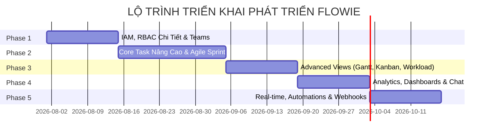

# KẾ HOẠCH TRIỂN KHAI CÁC CHỨC NĂNG CÒN THIẾU — FLOWIE

Tài liệu này xác định chi tiết kế hoạch thực thi (Implementation Plan) cho các tính năng chưa triển khai hoặc mới triển khai một phần của dự án **Flowie**, dựa trên phân tích từ `project_management_app_analysis.md`.

---

## 📌 TỔNG QUAN CÁC GIAI ĐOẠN (PHASE OVERVIEW)

---

## 🚀 PHASE 1: NÂNG CẤP IAM, QUẢN LÝ THÀNH VIÊN VÀ PHÂN QUYỀN (MODULE 1)

### 🎯 Mục tiêu
Đưa hệ thống Quản lý Tài khoản & Phân quyền lên cấp độ Enterprise: quản lý phiên từ xa, tạo Custom Role linh hoạt, phân nhóm Phòng ban (Teams) và hoàn thiện luồng mời thành viên.

### 🛠️ Chi tiết công việc

#### 1. Quản lý Phiên Đăng nhập (Session Management - 1.1)
- **Backend (Go):**
  - Đấu nối bảng `sessions` (`0010_iam_advanced.sql`): `id`, `user_id`, `token_hash`, `user_agent`, `ip_address`, `last_seen_at`, `expires_at`.
  - Viết middleware kiểm tra & cập nhật `last_seen_at`.
  - Tạo Handlers & Endpoints:
    - `GET /api/v1/me/sessions`: Danh sách các phiên đang hoạt động.
    - `DELETE /api/v1/me/sessions/{id}`: Đăng xuất/Thu hồi token từ xa.
    - `DELETE /api/v1/me/sessions`: Đăng xuất tất cả thiết bị khác.
- **Frontend (Next.js):**
  - Xây dựng trang `Account / Settings › Sessions` hiển thị thông tin thiết bị (Browser, OS, IP, Last Active) kèm nút "Đăng xuất".

#### 2. Custom Roles & Fine-grained Permissions (RBAC Chi tiết - 1.2)
- **Backend (Go):**
  - Đấu nối các bảng `roles`, `permissions`, `role_permissions`.
  - Chuyển đổi middleware phân quyền từ checking role tĩnh sang checking permissions chi tiết (VD: `task.create`, `budget.view`, `comment.delete`).
  - Tạo Handlers & Endpoints:
    - `GET /api/v1/workspaces/{id}/roles`: Danh sách Custom Roles.
    - `POST /api/v1/workspaces/{id}/roles`: Tạo / Cập nhật Custom Role kèm danh sách `permission_ids`.
    - `DELETE /api/v1/workspaces/{id}/roles/{roleId}`.
- **Frontend (Next.js):**
  - Xây dựng trang `Settings › Roles & Permissions`:
    - Giao diện tạo Role mới.
    - Bảng Checkbox phân quyền ma trận chi tiết theo từng nhóm chức năng (Task, Project, Budget, Member).

#### 3. Quản lý Đội nhóm / Phòng ban (Teams & Departments - 1.3)
- **Backend (Go):**
  - Đấu nối các bảng `teams`, `team_members`.
  - Endpoints CRUD Teams: `GET/POST/PUT/DELETE /api/v1/workspaces/{id}/teams`.
  - Hỗ trợ gán Task cho `TeamID` và gửi thông báo cho cả Team.
- **Frontend (Next.js):**
  - Trang `Settings › Teams`: Tạo phòng ban (Dev, Marketing, QA), thêm/xóa nhân sự.
  - Component Assignee Selector: Hỗ trợ chọn cá nhân hoặc chọn cả Team.

#### 4. Quy trình Mời Thành viên (Invite Flow):
- **Backend (Go):**
  - Endpoint `POST /api/v1/workspaces/{id}/invites` (sinh invite token, gửi email/link).
  - Endpoint `POST /api/v1/invites/{token}/accept` (xác nhận tham gia & gắn role mặc định).
- **Frontend (Next.js):**
  - Modal "Mời thành viên" trên trang `Settings › Members` với lựa chọn gán Role ban đầu.

---

## ⚡ PHASE 2: QUẢN LÝ CÔNG VIỆC CỐT LÕI NÂNG CAO (MODULE 2 & MODULE 3)

### 🎯 Mục tiêu
Giúp Task quản lý được nhiều thông tin phức tạp, tích hợp Custom Fields, Task Dependencies, đồng hồ bấm giờ live và quy trình duyệt Timesheet.

### 🛠️ Chi tiết công việc

#### 1. Phân cấp Epic & Custom Status Workflow (3.1)
- **Backend (Go):**
  - Đấu nối `workflow_statuses` per project: `id`, `project_id`, `name`, `category` (todo/in_progress/done), `position`, `wip_limit`.
  - Bổ sung hỗ trợ cấp độ `Epic` (Task cha cấp cao nhất).
- **Frontend (Next.js):**
  - Giao diện `Project Settings › Workflow`: Cho phép PM tùy chỉnh các trạng thái của dự án (Thêm cột, đổi màu, sắp xếp thứ tự).
  - Task Detail Drawer: Badge phân biệt Epic / Task / Sub-task.

#### 2. Trường Tùy Chỉnh (Custom Fields - 3.4)
- **Backend (Go):**
  - Đấu nối schema `custom_field_defs` và `custom_field_values` (`0008_custom_fields_deps.sql`).
  - Phân loại type: `text`, `number`, `dropdown`, `date`, `formula`.
  - APIs:
    - `GET/POST /api/v1/projects/{id}/custom-fields`
    - `PUT /api/v1/tasks/{id}/custom-fields`
- **Frontend (Next.js):**
  - UI quản lý Custom Fields trong Project Settings.
  - Render động các input tương ứng (Dropdown picker, Number input, Date picker) trong Task Detail Drawer và Task List View.

#### 3. Công Việc Phụ Thuộc (Task Dependencies - 3.4)
- **Backend (Go):**
  - Đấu nối schema `task_dependencies` (`task_id`, `depends_on_task_id`, `dependency_type`).
  - Validation: Chặn hoặc cảnh báo khi người dùng chuyển trạng thái "Done" nếu task tiền đề chưa hoàn thành.
- **Frontend (Next.js):**
  - UI thêm mối quan hệ "Blocked by / Blocks" trong Task Drawer.
  - Warning banner trên Task nếu đang ở trạng thái bị Block.

#### 4. Time Tracking Live & Phê Duyệt Timesheet (3.3)
- **Backend (Go):**
  - API Live Timer:
    - `POST /api/v1/tasks/{id}/timer/start`
    - `POST /api/v1/tasks/{id}/timer/stop` (tự động tính số phút và ghi vào `worklogs`).
  - Quy trình Phê duyệt Worklog:
    - Trạng thái worklog: `draft` -> `submitted` -> `approved` / `rejected`.
    - API `POST /api/v1/timesheets/submit`, `POST /api/v1/timesheets/approve`.
- **Frontend (Next.js):**
  - Widget Đồng hồ bấm giờ (Floating Timer) dưới góc màn hình.
  - Trang `Timesheet`: Thêm nút "Gửi trình duyệt" (Submit for Approval) cho nhân viên và giao diện duyệt cho Manager.

#### 5. Backlog & Sprint Capacity Management (3.2)
- **Backend (Go):**
  - Tính toán tổng Story Points trong Sprint vs Capacity tối đa của Team.
  - Thêm trường sắp xếp ưu tiên MoSCoW (`must_have`, `should_have`, `could_have`, `wont_have`) & RICE Score.
- **Frontend (Next.js):**
  - View Backlog: Thanh hiển thị % Sprint Capacity (xanh/đỏ cảnh báo quá tải khi kéo task vào Sprint).
  - Bộ lọc ưu tiên MoSCoW/RICE trong Backlog.

---

## 🎨 PHASE 3: HIỂN THỊ VÀ TRỰC QUAN HÓA CHUYÊN SÂU (MODULE 4)

### 🎯 Mục tiêu
Cung cấp các góc nhìn đa chiều mượt mà (Kanban kéo thả thật, Gantt Chart có đường găng, Workload cân bằng tải).

### 🛠️ Chi tiết công việc

#### 1. Kanban Board Nâng Cao (4.2)
- **Frontend (Next.js):**
  - Cập nhật thư viện kéo-thả chuẩn (`@hello-pangea/dnd` hoặc `dnd-kit`).
  - Hiển thị Cảnh báo **WIP Limit** trên đầu cột (Ví dụ: cột "In Review" vượt quá 5 tasks sẽ chuyển sang màu cam/đỏ).
  - Thêm tính năng gom nhóm Swimlanes (Group by Assignee, Group by Epic).

#### 2. Gantt Chart & Critical Path / Đường Găng (4.3)
- **Backend (Go):**
  - Xây dựng thuật toán CPM (Critical Path Method) tính toán các công việc thuộc đường găng quyết định tiến độ dự án.
  - API `GET /api/v1/projects/{id}/gantt`: Trả về danh sách Task kèm Dependencies và cờ `isCriticalPath`.
- **Frontend (Next.js):**
  - Tích hợp thư viện Gantt tương tác (như `frappe-gantt` hoặc SVG custom).
  - Vẽ đường mũi tên nối các Task phụ thuộc (Dependencies).
  - Highlight đường găng (Critical Path) màu đỏ để PM nhận biết các task rủi ro.

#### 3. Workload View Cân Bằng Tải (4.5)
- **Backend (Go):**
  - API `GET /api/v1/projects/{id}/workload`: Tính số giờ estimate + worklog theo từng nhân sự / từng ngày.
- **Frontend (Next.js):**
  - Trang Workload View: Cảnh báo ô đỏ nếu 1 nhân sự bị gán quá 8h/ngày.
  - Tính năng kéo thả task trực tiếp từ người bị quá tải sang người đang rảnh.

---

## 📈 PHASE 4: BÁO CÁO, DASHBOARD & CHAT TÍCH HỢP (MODULE 5 & MODULE 7)

### 🎯 Mục tiêu
Đo lường tiến độ Agile, báo cáo tài chính và cung cấp kênh giao tiếp chat trực tiếp nội bộ.

### 🛠️ Chi tiết công việc

#### 1. Custom Dashboards & Agile Reports (5.1 & 5.3)
- **Backend (Go):**
  - Aggregation APIs:
    - `GET /api/v1/projects/{id}/reports/burndown`: Dữ liệu Burndown Chart theo Sprint.
    - `GET /api/v1/projects/{id}/reports/velocity`: Dữ liệu Velocity qua các Sprints.
    - `GET /api/v1/projects/{id}/reports/financial`: Chi phí thực tế vs Ngân sách (`worklog_minutes * hourly_rate`).
- **Frontend (Next.js):**
  - Trang `Analytics`:
    - Biểu đồ **Burndown Chart** (Đường lý tưởng vs Đường thực tế).
    - Biểu đồ **Velocity Chart**.
    - Cho phép tùy biến thêm/xóa/sắp xếp Grid Widgets.

#### 2. Chat Trực Tiếp & Kênh Dự Án (Direct & Channel Chat - 7.2)
- **Backend (Go):**
  - Đấu nối schema `channels`, `messages` (`0009_chat.sql`).
  - Endpoints:
    - `GET/POST /api/v1/channels`: Tạo kênh chat dự án hoặc direct chat 1-1.
    - `GET/POST /api/v1/channels/{id}/messages`: Gửi & tải tin nhắn.
- **Frontend (Next.js):**
  - Khung Chat Widget hoặc Trang `Messages`: Hỗ trợ chat nhóm theo dự án, chat riêng giữa 2 nhân sự, gửi đính kèm file.

#### 3. Cảnh Báo & Inbox Nâng Cao (7.1)
- **Frontend (Next.js):**
  - Nâng cấp Inbox Notification Center: Bộ lọc thông báo tab "Được nhắc đến (@mentions)", tab "Quá hạn (Overdue)", tab "Cập nhật Task".

---

## 🔗 PHASE 5: TỰ ĐỘNG HÓA, REAL-TIME VÀ TÍCH HỢP BÊN THỨ BA (MODULE 6 & NFR)

### 🎯 Mục tiêu
Giúp ứng dụng hoạt động real-time tức thì, hỗ trợ tạo tự động hóa linh hoạt và mở cổng API cho các công cụ bên ngoài.

### 🛠️ Chi tiết công việc

#### 1. Cập nhật dữ liệu Real-time (WebSockets - NFR 8)
- **Backend (Go):**
  - Xây dựng WebSocket Hub (`gorilla/websocket` + Redis Pub/Sub nếu scale).
  - Broadcast các sự kiện: `task_created`, `task_updated`, `status_changed`, `comment_added`.
- **Frontend (Next.js):**
  - Tích hợp WebSocket client: Tự động cập nhật giao diện Kanban/List view ngay lập tức khi thành viên khác thao tác mà không cần bấm Refresh.

#### 2. Rule-based Automations Nâng Cao (6.1)
- **Backend (Go):**
  - Nâng cấp Rule Engine hỗ trợ DSL JSON: **Trigger -> Condition -> Action**.
  - Ví dụ: Trigger (`status_changed` to "QA") -> Condition (`priority` == "High") -> Action (`assign_to` QA Lead + `send_notification`).
- **Frontend (Next.js):**
  - Trang `Project Settings › Automations`: UI tạo Rule dạng khối trực quan.

#### 3. Public REST API & Native Integrations (6.2 & 6.3)
- **Backend (Go):**
  - Quản lý API Key & Webhooks Out: `POST /api/v1/webhooks`.
  - Tích hợp Native GitHub/GitLab: Webhook nhận sự kiện commit/PR kèm Task Key (VD: `FLOW-123`) để tự động chuyển trạng thái task.
- **Frontend (Next.js):**
  - Trang `Settings › Integrations`: Kết nối GitHub, Slack, Webhooks.

---

## 📅 BẢNG TỔNG HỢP NGUỒN LỰC VÀ MA TRẬN PHÂN CÔNG (RACIM MATRIX)

| Phase | Module | Thời Gian Dự Kiến | Độ Ưu Tiên | Kiểm Thứ Mẫu (DoD) |
|---|---|---|---|---|
| **Phase 1** | Module 1 (IAM) | 2 Tuần | 🔴 High | Mời thành viên mới, tạo Custom Role thành công và kiểm tra chặn quyền chuẩn xác; thu hồi session vô hiệu token cũ. |
| **Phase 2** | Module 2 & 3 (Core Task & Worklog) | 3 Tuần | 🔴 High | Bấm đồng hồ live timer ghi worklog, gán Custom Fields, tạo Task Dependency chặn status đúng logic. |
| **Phase 3** | Module 4 (Advanced Views) | 2 Tuần | 🟡 Medium | Kanban cảnh báo WIP Limit, Gantt Chart hiển thị mũi tên phụ thuộc và highlight đường găng CPM. |
| **Phase 4** | Module 5 & 7 (Analytics & Chat) | 2 Tuần | 🟡 Medium | Vẽ biểu đồ Burndown/Velocity chuẩn xác, gửi tin nhắn Chat real-time trong kênh dự án. |
| **Phase 5** | Module 6 & NFR (Realtime & Auto) | 2 Tuần | 🟢 Low | Hai trình duyệt tự đồng bộ task qua WebSocket; Rule tự động chạy khi task đổi trạng thái. |

---

> 💡 **Ghi chú:** File kế hoạch này được lưu trữ tại [IMPLEMENTATION_PLAN.md](file:///C:/Users/Hoang%20Tu/Desktop/BSR/1.%20Source%20Code/Flowie/docs/IMPLEMENTATION_PLAN.md). Toàn bộ mã nguồn backend Go và frontend Next.js sẽ được phát triển tuân thủ theo đúng thứ tự các Phase trên.
